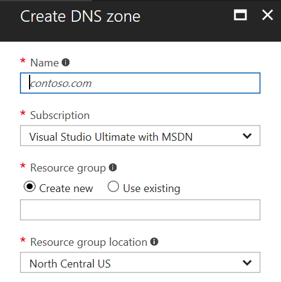
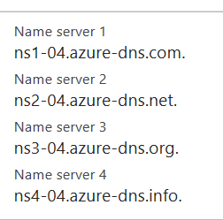
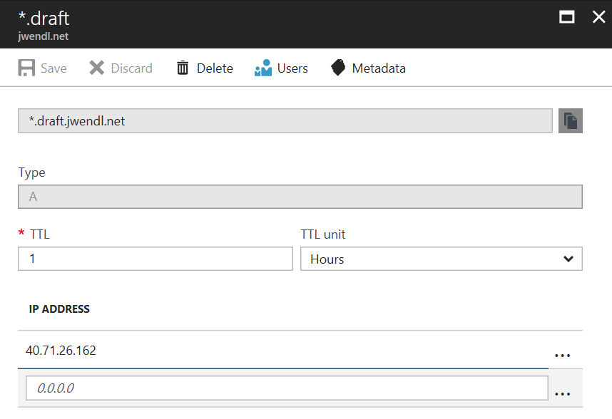

# Draft on Azure Container Service

This document explains how to utilize Draft to deploy a "Hello World" application using a linux docker container to an ACS cluster.

We will utilize the [Azure Command Line](https://github.com/Azure/azure-cli) to create instances in Azure to support this functionality.

First we will create the resource group and the Azure Container Service
```bash
resourceGroup="ResourceGroup"
location="eastus"
acsEnvironment="DraftExampleEnvironment"
acsDnsPrefix="draftexampleenvironment"

az group create --name $resourceGroup --location $location
az acs create --orchestrator-type=kubernetes --resource-group $resourceGroup --name $acsEnvironment --dns-prefix $acsDnsPrefix --generate-ssh-keys
sudo az acs kubernetes install-cli
az acs kubernetes get-credentials --resource-group $resourceGroup --name $acsEnvironment 
```

This next step creates an Azure Container Registry for Azure Container Service to use
```bash
subscriptionId=""
registryName="DraftRegistry"
registryRbacPassword="PaSSW0rd!"

az acr create --name $registryName --resource-group $resourceGroup --location $location --sku Basic
az ad sp create-for-rbac --scopes /subscriptions/$subscriptionId/resourceGroups/DraftSandbox/providers/Microsoft.ContainerRegistry/registries/$registryName --role Owner --password $registryRbacPassword
```

After creating the registry and container service above, we will install helm, and draft similar to the instructions on the [Getting Started Guide](getting-started.md)

```bash
wget https://storage.googleapis.com/kubernetes-helm/helm-v2.5.0-linux-amd64.tar.gz
tar -zxvf helm-v2.5.0-linux-amd64.tar.gz
sudo mv linux-amd64/helm /usr/local/bin
wget https://azuredraft.blob.core.windows.net/draft/draft-canary-linux-amd64.tar.gz
tar -zxvf draft-canary-linux-amd64.tar.gz
sudo mv linux-amd64/draft /usr/local/bin
helm init
```

Before running draft init, we will need to ensure we have an ingress controller installed and that we setup a DNS entry for *.draft.contoso.com (replacing contoso with your domain)
```bash
helm install stable/nginx-ingress --namespace=kube-system --name=nginx-ingress
kubectl --namespace kube-system get services nginx-ingress-nginx-ingress-controller
```

To setup DNS entries, we would want to setup an A record that points to *.draft.domain.com. In my exmaple, we are using Azure DNS services by pointing my registrar to name servers that Azure DNS provides.



Then in your domain registrar (I am using Hover), we would setup the name servers to point to the name servers inside the Azure DNS Zone configuration.



Then we would create a new record set in the Azure DNS Zone using *.draft.contoso.com as an A record that points to the IP address that was output as the external ip address from the above kubectl command.



Once that is all setup, we can continue with the rest of the instructions on the [Getting Started Guide](getting-started.md)

```bash
draft init
```

The draft init command needs the following for input
* Azure Container Registry URI
* User name (from the above az ad sp create-for-rbac command)
* Password (from the same command)
* Organization Id
* Root Domain Name (draft.contoso.com in our example)

```bash
git clone https://github.com/Azure/draft.git
cd draft/examples/dotnetcore
draft create
draft up
```

If we did everything correctly, we should see some output with our docker container name (like contoso-rocks) as a URI similar to http://contoso-rocks.draft.contoso.com/ 